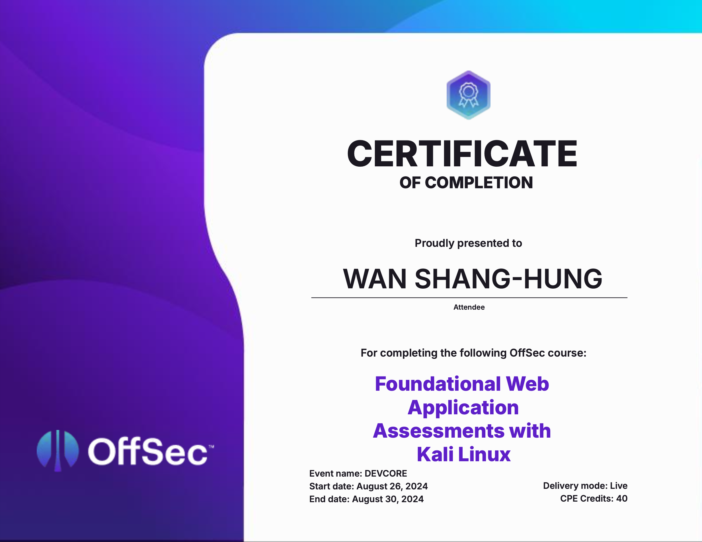
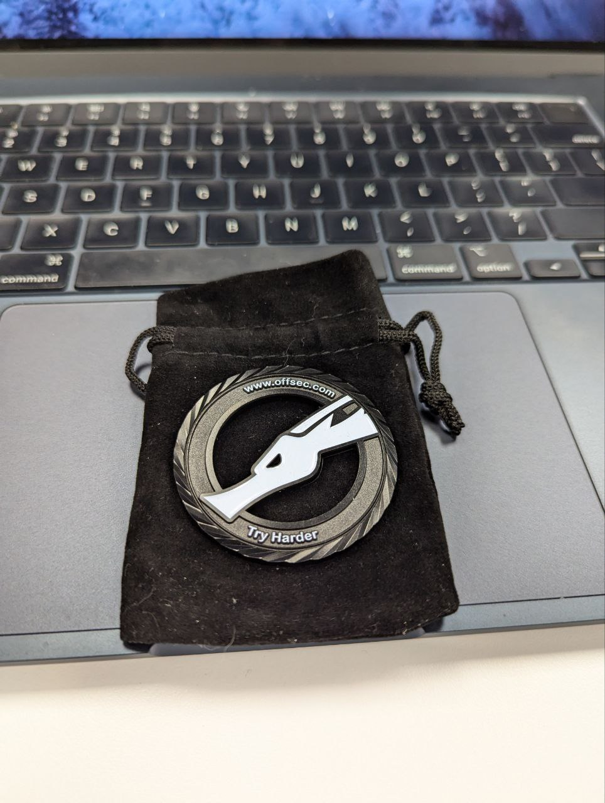

## Introduction

上個禮拜剛參加了 OffSec 跟 DEVCORE 合辦的 Live Training，趁著記憶猶新趕快來寫一下課程本身的心得。這次聽說是首次 OffSec 在台灣舉辦的 Live Training，也因為這樣，這次的課程還有送半年的 Learn Unlimited，簡單來說就是教材＋考照吃到飽，而且原價超貴，原廠賣一年 5799 鎂🫠。所以這次打算在半年內拼三張證照（沒意外應該是 OSWA、OSWE、OSCP），直接回本👍，後面考過證照再來寫考照的心得，所以希望這系列有 Part 2、3、4 XD。

附上參與證明：

<!-- more -->

## Before Class

在課前其實也有點緊張，因為自己其實沒考過任何資安相關的證照，總覺得遙不可及（？），再加上 OffSec 是很知名的廠商，所以自然對它期待較高，問了身邊的同事跟朋友都說不會太難，才比較放心的去上課了，~~不過課前的練習我也都沒做~~。

## During Class

開始上之後發現其實白擔心了，太過簡單了XD 都是很基礎的部分，像 XSS、SQLi、XXE、SSRF、SSTI 等，而且沒任何特別的技巧或繞過等，就是你找到洞就打得穿的類型，如果是常打 CTF 的人大概閉著眼睛都可以秒解，~~所以上起來其實有點偏無聊，大概九成都是學過的東西~~。

再來關於講師，講師基本上都是原廠認證的講師，聽說問券分數太低還會被撤銷講師資格，所以講課內容通常不會有什麼太大的問題，我們的講師好像也同時是其他幾張證照的講師，所以能力也沒什麼問題，像我後來很無聊就問他 OSWE 的問題，他也很親切地回答我，人真好👍；而人力的話是一個講師跟一個助教，配我們班學員大概 15 人左右，所以也不太會有有問題但問不到的情況；另外講師跟助教雖然不是印度人，但有點印度腔（？），不過其實講的單字跟文法都很簡單，加上腔調蠻輕的，所以大概九成以上都聽得懂。

課程時程的話，是相當硬的早九晚六連續五天，雖然課程本身難度蠻低的，還是耗了不少精力🫠 體感大概是七成講課，三成練習 Lab，而 Lab 本身就跟教材難易度差不多，所以有認真上課應該都做得出來，就算真的做不出來講師也會再詳細講解一次，相當親切XD 另外有一點蠻重要的，因為其實教材跟內容基本上就是一樣的，但講師的好處是你可以問 Extra Mile 相關的問題，因為 Extra Mile 通常是官方希望你自己研究，所以不會有答案，在官方 Discord 問也不會告訴你，這是唯一一個有機會有官方人員告訴你答案的了 XD 論壇發問可能也會有人回答，不過就是社群回答而不是官方人員ㄌ

講到 Extra Mile，有點像是課程挑戰的 Lab 一樣，通常比 Lab 難（但也不會難到哪裡去），也不會告訴你答案，讓你自己研究，講師在上課的時候就用這個來當獎勵題，前幾個答對的就會發給你一個~~好寶寶徽章~~ coin，長這樣：

聽說跟 PEN-200 的長一樣，大概只有隔壁的 EXP-401 才有酷酷的超帥 Coin，~~沒圖，請自己找 Orange 的 Blog~~

然後我們這邊有蠻多認識的大佬，大概就是有半個班級去裸考都會過的程度，我自己在第三天就把全部的 Challenge Labs 解完，現場安排下週末考試，就開始看 OSWE 的教材了，第五天統計好像 2/3 都已經完成全部的 Challenge Labs，講師也有點傻眼XD 就發給全部完成的學生一人一個了，還說是近期發最多 Coin 的。

既然都講到 Challenge Labs 了，順便提一下，你做完就會發現，他其實是要考你情蒐或是滲透的能力，而不是漏洞利用或是奇技淫巧，因為機器都是黑箱的，所以你就需要去利用現有情報去推斷可能的攻擊面（甚至是通靈🤯）來找到漏洞在哪。而找到之後其實就很簡單，因為這張是初級證照，也不是要為難你，所以在黑箱情況下大部分的利用方式都是最簡單的 Payload 就可以解決，不用 Bypass 或 Evasion 等。（p.s. 這邊僅限 Lab，我還沒考不知道 Exam 是不是也這樣）

另外講個小插曲，其實上課的過程有點尷尬（？），因為講師比較喜歡問大家問題，但是 2/3 的人在解 Challenge Lab 或已經到 OSWE 了，剩下的新手回答不出來，所以通常沒什麼人回答問題，講師就只好摸摸鼻子繼續講下去😶

## Conclusion

上完一週課其實還是蠻充實的，~~畢竟做完了全部 Lab 跟看了下一張證照的課程~~，在把上課過程當 BGM 聽的過程其實也有系統性的複習了初級的一些技巧，也多學了一些 Kali 工具跟一點滲透的概念，也不全無收穫。再加上可以跟厲害的大家一起學習、討論五天其實是很棒的一個體驗，不僅可以跟講師請教，也可以跟同學互相討論，讓我度過了蠻有趣的五天。

不過如果有下次選擇的話，像是 OSCP、OSWE 這種比較簡單的證照還是自己學就好，除非哪天我腦袋撞到想要挑戰 OSEE 的話，我才會想要再報 Live Training 吧 XD

自己也希望 Live Training 可以做一些事前測驗、實力檢測，或是先透露一些比較簡單的 Lab 之類的，比較方便學員知道自己的實力或需求適合哪張證照，不然學員實力超出課綱太多或太少，不僅對學員沒什麼太大的幫助，對講師也不好上課。

也給讀者一些建議，如果你是初學者或完全沒接觸過，我覺得都可以從這張下手，不管是 Live Training 或是自己買教材讀，但如果你本來就在打 CTF 或是有實際的滲透、漏洞挖掘經驗的話，買教材自己讀就好。而如果是稍微有點經驗且時間有限只能考一張的話，聽我一句話，不要浪費時間，直上 OSWE XD

懶人包大概是這樣：

適合：
- 在網路上找到一堆資安教材但都看不懂的新手
- 想快速培訓人員的企業
- 短時間要考到證照
- 想找人討論/問問題

不適合：
- 沒錢
- 本來就有網頁安全或滲透測試等相關經驗
- 有充足的時間或自學能力

總結一下，這個課程整體來說還是蠻不錯的，但若有金錢考量的話，可能不是 CP 值最高的選擇，不過非常非常適合新手，也適合想要入門網頁安全的人（雖然個人覺得 OSCP CP 值比較高）。
