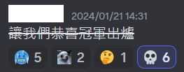
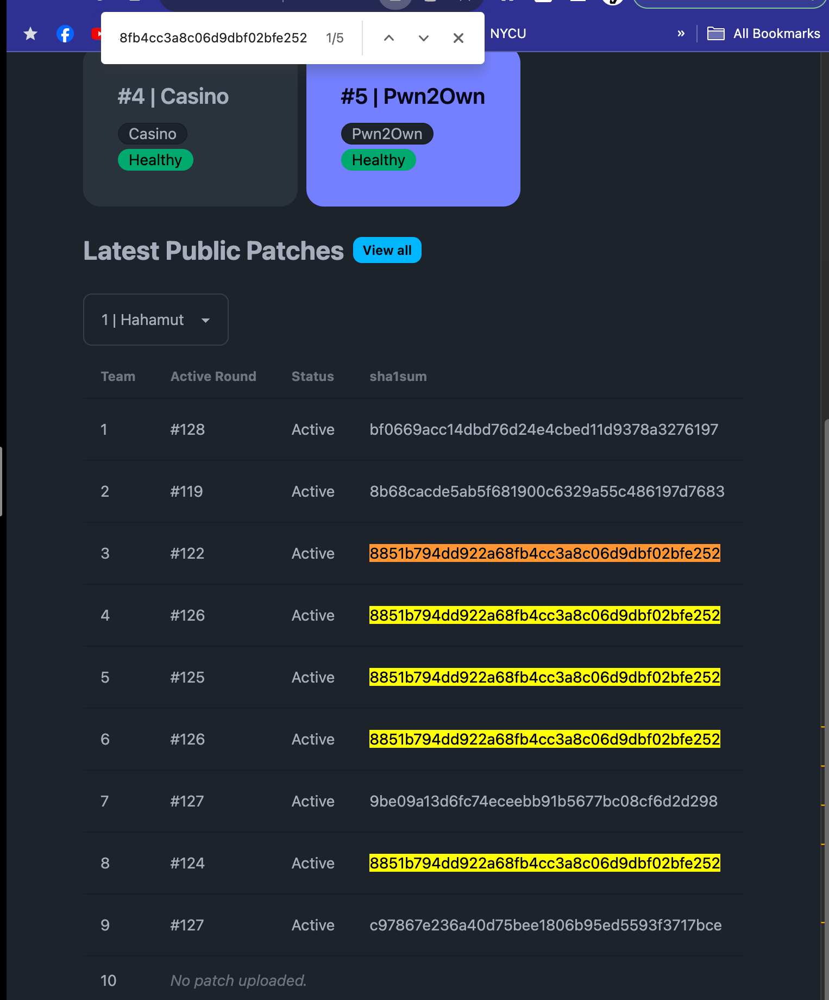
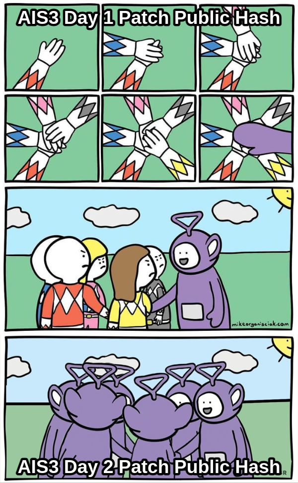

## Introduction

此次是第二次參加 AIS3 EOF，同時也是第一次進到 Final，雖然名次蠻後面，不過蠻有趣的，還是稍微寫篇文章記錄一下過程。其實本來因為成績不是很好沒打算寫的，但是過年太閒了再加上剛好看到官方開了個 write-up channel，所以就稍微紀錄一下，這篇會比較偏心得跟遊記（？），不會有太多技術含量。

<!-- more -->

## Team Matching

此次分隊大致是依照初賽名次依序選擇隊伍（還有其他規則，~~不過不是很重要~~），因此隊伍的組成只會有三種，親友團、大神團跟 Others，所以開賽前大家就



最後冠軍也確實是名次最高組成的那隊，不過大家主要比較想跟認識的一組，所以其實大部分人好像也沒那麼在乎實力是否真的平均。

話說回這次的隊伍，因為這次初賽沒多少時間 + 打得很爛qq，所以很後面才選，而且認識的還都跑去出題了，最後選了一個只有兩個看過的 ID 的隊伍，基本上算是全部不認識（？），不過打完比賽也因此多認識了很多新朋友，也算是一個不錯的收穫。

## Pre-competition

這次由於隊友互相好像都不太認識，所以賽前沒有做什麼特別的準備，基本上只有幾個部分：

1. Attacker Manager：要一個 Attacker Manager 隊伍可以比較方便管理 exploit 之類的，我們是用[這套](https://github.com/DestructiveVoice/DestructiveFarm)，不過這次 protocol 不一樣，所以還是要小改一下。
2. ELK：這套是 Terry1234 提出的，據他說之前 HITCON Final 他們隊伍用的，分析封包比較方便，但是我們最後因為沒時間所以沒架。
3. VPN：因為這次要透過 Jump Server 才能存取 dashboard 之類的，所以還是要幫大家在上面架個 VPN，這次我們是用 WireGuard。

賽後看了一下其他隊的 Write-up，發現其他隊還有準備一些 PCAP 搜尋或分析跟混淆工具之類的，下次有機會的話也應該準備一下，我們沒準備導致比賽時浪費了不少時間QQ

另外賽前還有個隊員臨時退賽，所以我們還直接 -1 剩 7 人，還有在賽前也互相了解一下大家的專長，比較多是 web，再來就是 pwn，不過我們只有我跟 Terry 有打過 A&D、KoH 之類的賽制，所以大家經驗不太足夠，稍微有點劣勢。

## Day1

比賽一開始就有點狀況，首先是我因為誤判機器規格先把 Attacker Manager 架在 Jump Server 上，結果開賽的時候 7 人連上 VPN + Attacker Manager + 不知道誰把 ELK 架在上面，機器直接資源吃滿炸掉，連 SSH 都進不去😥

後來因為題目先放出了，就決定先讓大家分開各自看題目，等到 A&D 的 exploit 寫出來後我再來修 Attacker Manager，避免前面落後太多進度。

### A&D

我主要是看 A&D，是 maple 出的 Node.js 的 web 題，裡面根據他賽後放出來的 code 來看大概有 18 個洞，應該算是一個蠻好打的題目（但是大部分都沒人打 XD），一開始看到題目先看到有一個 `globalThis` 可以找到 `eval()`，就先花了點時間寫了個 cookie 的 deserialization 的 payload 給隊友寫 exploit，這邊還忘記可以用 `atob()`，害我浪費蠻多時間在研究怎麼繞過 `,`，最後是用 spread operator：

```plaintext=
js:eval:p=globalThis.clearImmediate.constructor.constructor('return process')();a = ['/flag'];a.push('/app/public/.md-text.js');a.push(2);p.binding('fs').copyFile(...a);
```

寫完這個 payload 也順便寫了個 patch，不過因為怕被別人抄走（不知道為什麼那時候不找混淆工具==），就先丟給隊友等我們被打的時候再上，這個 exploit 前期印象中可以打蠻多隊伍的，賺了不少分👍。

其實下午研究封包大家也都只有打 1、2 個洞，所以我們就只簡單上了幾個 patch 封掉那些廢洞，不過這邊我們其實也沒找到什麼其他的洞，所以主要時間都花在手動看封包跟 patch 上，學到的血淚教訓：工具很重要 QQ。

另外這題的一個重點是蠻嚴格的 service check，因為其實一開始有看到很多暴力的 patch，像是直接把整個功能拔掉的，但是當然不會過 service check。賽後大概看了一下 source code，基本上每個功能都會 run 一次，且也有做不少的 assertion，所以沒有好好想過再 patch 的話高機率會爛掉 XD。比賽中看 scoreboard 上大家大部分的時間都是 service down，而隊友 tcy4d 上的 patch 還算不錯，所以我們靠 service check 就拿了不少分。

### Pwn2own

這題主要是 Terry1234 賽前就提出說要負責，而我那時也想說他擅長 pwn 應該很適合，結果第一天大概過了 2/3 的時候他說其他隊伍打的全部都是 web 爛洞，根本是 web 題==。

結果由於我們都配 pwn 仔到這題，人力分配不均的狀況下，讓我們第一天基本上沒什麼進展，一分都拿不到QQ。

### KoH

KoH 基本上都是隊友負責的，所以基本上我只有大概確認每題都有人負責跟大家沒遇到什麼困難，雖然就算 ICPC 遇到困難我也不會寫組語🤡

另外 rush p0pp3r 大概看了一下題目，蠻有趣的，基本上就是「自己懶得出題目，叫 GitHub 上的開發者幫我出」by splitline：

```plaintext=
找到網路上隨便一個 composer package 裡的反序列化 RCE gadget，越好用+越短越好。
```

### After-competition

晚上就是繼續寫作業的時間了，我們回顧了一下今天的問題，主要都是沒有即時修正，還有事前準備不足導致浪費很多時間在處理工具跟 infra，因此我們重新分配人力，把我們位於前段班的 A&D 只留下一個人防守，剩下的人力分配到其他題去支援，同時因為隔天會放出新題「Casino」，所以也分配了一些人力過去研究。

另外我大概 12 點撐不住就先去睡覺了，結果隔天起床看到 email 通知 4 點多隊友還在 Trello 上發卡片😱，很感謝他們這麼拚 XD

## Day2

### A&D

昨天的那個 cookie deserialization 雖然好像是我們第一個開始打的，不過後續 payload 被抄走後我們也開始被打，所以 tyc4d 就先把我昨天寫好的 patch 補上，而後續他也持續在挖封包並上其他 patch，同時確保我們可以過 service check，這也讓我們有一段時間靠存活分跟些許的攻擊分就從 A&D 單題分數第七衝到第二的位置，不過想當然爾，我們的 patch 也很快就被別人抄走：

而且這還不是最多的，我記得最多的時候好像有 6 組左右都用我們的 patch XD

這邊就是我的錯了😥我當下沒有提醒隊友要記得混淆，自己也沒找到其他新洞或繞掉自己的 patch（~~下次 patch 不能寫這麼好~~），不然這題應該要可以第一的。

所以下午在大家都互相打不太動的時候分數就慢慢被超過了，結算好像是第四左右，是我們全部的題目中最佳的成績了 XD

是說這次大家都很善良（？），或是大家都在忙其他題，感覺沒人弄一些比較有趣的玩法，連後門都沒放，導致大家抄作業抄得很開心 XD，放張 discord 上別人做的 meme：



賽後看 maple 釋出的 [source code](https://github.com/AIS3-EOF/2024-ad-hahamut-public)，其實很多洞都是老梗或是解過的，超級懊悔為什麼都沒找到QQ，不過我覺得 maple 的題目出得蠻好的一點是他蠻會藏洞的，很像是真實情況下開發者會因為疏忽或不熟寫出來的漏洞，~~不會像有的一眼看過去就看到很刻意的洞~~，是需要很細心 code review 過才能找到的。所以其實很多洞都沒人打，我猜大部分都沒人發現，而另外有趣的是，這題機器因為每 round 不會重置，所以其實可以 persist 去賺長期分數，但也沒人注意到 XD

順便記錄一下新學到的知識點：

- Node 的 crypto 如果在加解密 AES-GCM 的時候沒呼叫 `.final()`，會變成 AES-CTR ([maple's blog](https://blog.maple3142.net/2022/07/24/dicectf-at-hope-writeups/#payment-pal))
- SQLite 可以任意寫檔，可以用來 RCE ([PayloadsAllTheThings](https://github.com/swisskyrepo/PayloadsAllTheThings/blob/master/SQL%20Injection/SQLite%20Injection.md#remote-command-execution-using-sqlite-command---attach-database))

### Pwn2own

這邊我後來也有花一些時間去看，但因為我第一天沒看這題，在題目的 code 都還沒看完的時候主辦又上了好多版 patch，還要寫點 script 跑 diff 之類的，還有主要是第一天的時候 web 爛洞就被補的差不多了，所以我就無能為力了😭

### KoH

這邊一樣交給隊友，另外稍微提一下，popper 這題當然不是 PHPGGC 跑下去就解決了，不過可以用它的 gadget 去找，這題其實賽後聽他講全場有解出來的都是用他以前的 gadget，根本沒人自己找 XD

### Casino

這題是第二天才釋出的題目，題目類型也蠻酷的，有點像 KoH 跟 A&D 的混合版，所以算是獨立的一個題型，前一天賽後有先釋出測試機給大家玩（aka 回家作業），大概有三個隊友先研究了，所以我就放心地去玩其他題，沒什麼碰了，不過聽官方賽後解題，其實是蠻有趣的一個題目，可惜沒玩到 XD。

### After party

今年好像是第一屆試辦 after party，基本上就是披薩炸雞吃到飽，給大家聊天（X）大型網友見面會（O），還算蠻不錯的安排，可以多認識一些人，或是跟其他隊刺探敵情之類的 XD

## Conclusion

其實沒注意到最後我們排名多少 XD，應該是第七左右，比較可惜的是雖然我們的隊伍組成比較偏 web，理論上應該要可以在這次 web 占比很大的情況下得利，但在人員分配跟比賽細節上沒做好，自己技術也不夠強，導致結果不盡理想。但依舊是一個很好的經驗，希望明年變強之後再來復仇💪
