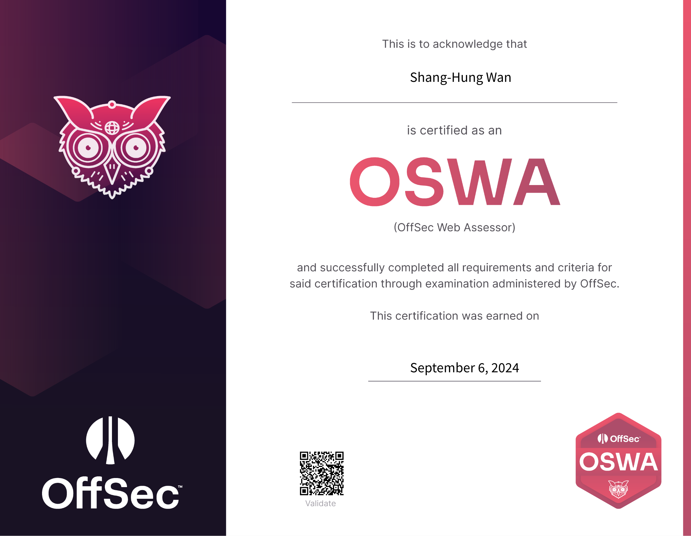
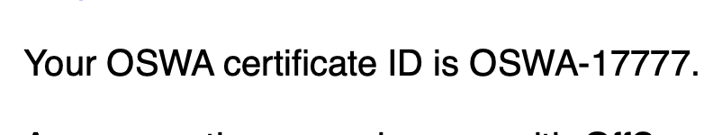
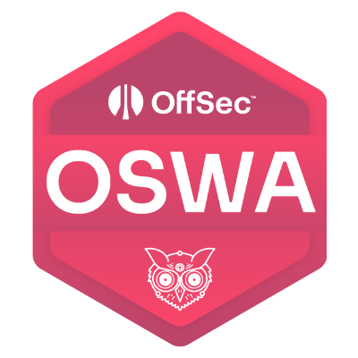

## Introduction

這篇文章算是第二集，如果沒有看過上集的可以點 [2024 OffSec x DEVCORE Live Training － OSWA](./2024/09/02/2024-offsec-oswa-live-training/)。

雖然在上課時就約好考試了，而且 lab 跟課程內容大致都沒有問題，但第一次考試還是有點緊張，很怕一題沒通靈出來就要全部重來 🫠 還好最後還是順利通過，以下就簡單分享一下大致的過程以及心得。

<!-- more -->

先上個人權：

## Before Exam

開始前還是聲明一下，這篇不會有什麼 Write Up 之類的技術細節，因為 OffSec 的限制很嚴格，不能透露任何 Exam、甚至 Lab 相關的資訊等，否則輕則取消證照，重則終身 Ban，不要輕易嘗試 🤐

首先第一步就是預約考試時間，這邊建議約個中午或下午之類比較有精神的時間，比較不會精神不濟發揮不良，不要像我一樣挑了一個 00:00 開考，直接作息死去，要不是這張比較簡單大概就不會過了 🫠

因為考試會持續 23 小時 45 分（不是 24 的原因是 15 分鍾是開始前的檢查跟確認身份），所以適當的休息跟睡覺都是必須的，大概要留個個人平常睡飽的 8 ~ 9 成睡眠時間，個人是睡了大概七小時左右，比較不會精神不濟反而效率很差；而中間休息則是自己想休就休，跟監考官說一聲就好，所以卡住就可以出去洗個臉、上個廁所之類的，不要一直勉強自己坐在那邊。

安排好時間後，就會收到一封確認信，裡面有各種需要注意的事項，記得要先看過一遍，另外裡面還會有：

1. OSID
2. 一組 MD5
3. Proctoring Software 的連結
4. upload.offsec.com 的連結

## During Exam

### Identification Process

接下來就是等到考試當天了！考試開始前 15 分鐘就可以做好準備，並記得帶著你的護照，然後用 1.、2. 登入 3.，開始跟監考官確認身份、檢查環境並開始考試，注意太早進去沒用，只有前 15 分鍾會開放登入。

檢查環節主要有三步：

1. 確認身份：把護照拿到鏡頭前確認
2. VM 環境檢測：在 VM 裡面跑他提供的檢測 script
3. 環境檢查：舉著你的鏡頭繞房間一圈，確認沒手機跟其他電子裝置

以上都是透過打字，所以不用擔心聽不懂英文 XD 確認完後就會收到一封 Email，裡面有 VPN 可以連上題目，正式開始 23 小時又 45 分鍾的~~坐牢~~考試！

### Just Exploit!

關於考試過程，好像沒幾句話是可以公開的，只能講心得了 😶

我的開始時間是 00:00，所以本來預計先盡量不要打亂作息，開始後先把題目看一下就去睡覺，但這時候的我沒想到，期望很美好，但現實很殘酷，這一看就是天亮 🫠 總之因為這些題目大部分難度都跟 lab 差不多，所以大部分時間都是很簡單的，但通靈的程度跟 lab 比則是有過之而不及，導致題目解起來的速度是很極端的，有多極端呢？我在開始後的 145 分鍾才拿到第二個 flag，然後 2 分鍾後就拿到第三個，就是這麼極端。

大致時程是：

-   00:00 ~ 05:00 拿到三個 flag
-   05:00 ~ 13:00 睡覺、吃飯、休息
-   13:00 ~ 18:00 拿到兩個 flag
-   18:00 ~ 19:00 吃飯、休息
-   19:00 ~ 22:00 通靈出另外兩個 flag
-   22:00 ~ 23:45 寫報告、補截圖

總之就是考好考滿，考完身心靈俱疲，不知道之後考 48 小時的我怎麼辦 QQ 最後兩小時會開始寫報告主要是已經達通過門檻 70 分，剩下都沒頭緒，再加上截圖又不太夠，只好放棄開始寫報告 QQ

在考試過程主要要注意的有幾點，一是不要太糾結在同一台機器上，有時候想不出來就是想不出來，與其浪費時間不如先解其他題，可以設個限制，例如一小時沒進度就換台之類的，可能後面再回來一下就想到了；二是記得截圖，而且每步都要，一邊截圖可以省下不少寫報告的時間；最後是記得教材內容，個人心得是 lab 與 exam 都沒有什麼超綱的部分，所以找不到入口點或 exploit 點時，回去翻翻教材可能會很有幫助。三是記得休息，當你覺得精神渙散或是思考速度變慢的時候就該休息了，不管是去睡覺（睡覺的時候好像可以關掉 Proctoring，不過我懶得重弄就開個鏡頭睡覺了）或滑個手機（記得出去房間滑，不然直接分數歸零），多少都有一點幫助。

## After Exam

考完，解脫了！如果你是這樣想的，那就大錯特錯了，還需要在 24 小時內上傳滲透測試的報告，所以你還有一天要忙，不過如果圖都在考試時截完了理論上不會花太久，個人是考試時花了兩小時和隔天的五小時，共七小時。

再來很重要一點，要寫報告時，你會發現官方只提供了 DOC 跟 ODT 檔，俗話說得好，WORD 做報告，加班加不完，所以我用 Markdown 還原了官方的格式，用 Typora 輸出成好看的 PDF 後（偷臭一下，HackMD 雖然這麼多年後終於能輸出 PDF 了，但是還是沒很好看），再下載他的範本的第一頁封面，把兩個 PDF 拼起來交出去，實測是會過的，看起來沒被扣分 XD 雖然不保證後果，但可以自由拿去用：https://hackmd.io/@TaiYou/SJoITQyTA。

關於報告要注意的地方，如果你本來就有撰寫過 PT 報告的經驗，那應該輕而易舉，就只要每一步和平時一樣都寫清楚就好，可能還比平時簡單，因為這邊不用寫漏洞細節，也不用給修補建議之類的，只要說明怎麼找到的、怎麼重現就好；而新手的話，建議你可以把握幾點原則：

1. Where：每步驟的現在網址，加上做了之後的網址會更好
2. What：做了什麼操作，記得要給可以複製的指令或輸入值
3. Who：如果有不同帳號或複雜的權限操作，記得要標明
4. How：截圖是基本，要說明怎麼輸入 2. 或是怎麼操作，截圖有圈出操作的細節會更好

## Conclusion

寫完報告交出去後，就正式解脫了，接著就是慢慢等結果，本來說 10 個工作天內會通知，竟然兩天就收到 PASS 的結果了！而且驚喜的是收到了一個超好看的 certificate ID：

不過後來發現這 ID 根本不會出現在任何地方，所以只能自己看著這封 Email 開心 🫠 另外除了證書，還會有個 badge 讓你可以放在 GitHub 或其他地方：

最後總結一下對這張證照的感想，這張我認為是給想初探網頁安全的新手一個很好入門的證照，但擁有它不是證明說你擁有什麼實力，而是證明你至少有了跟那些大神的共同語言，畢竟 Web 是不斷在進化，其實很難有什麼永遠不會過期的證照或教材，但我相信做為 Web Security 的第一塊敲門磚是蠻適合的（但價錢可能沒那麼適合 XD）。

有的人可能會說考 OSWE 就不需要這張了，我會覺得若以工作或實用角度的話，直接考 OSWE 就好了，但如果你是以學習的角度（~~或是你有全成就之類的強迫症~~），我會說這張可以學到跟 OSWE 不一樣的東西，所以像你如果剛好買了 Learn Unlimited 還是可以順路考一張來體會一下 XD

另外，雖然我兩篇文都在笑說這張證照很通靈，但想補充的是，其實你永遠不知道同樣的場景會不會在未來真正發生，這也何嘗不是黑箱滲透的精神呢？雖然我不是什麼紅隊或 PT 的專家，但參與過幾場類似的演練，必須得說某些程度上是有些類似的，但我會說 OSWA 的設計其實通常比現實世界更好理解也更好 exploit，畢竟現實有時比小說還離奇 XD 要說為什麼的話，就是 OSWA 還是有一種 OffSec 味（我相信其他 OffSec 的證照應該也類似），所以只要 lab 都有做應該就可以輕鬆通過了，至於什麼是 OffSec 味，就留給讀者自己去考一張來體會了 🫢
