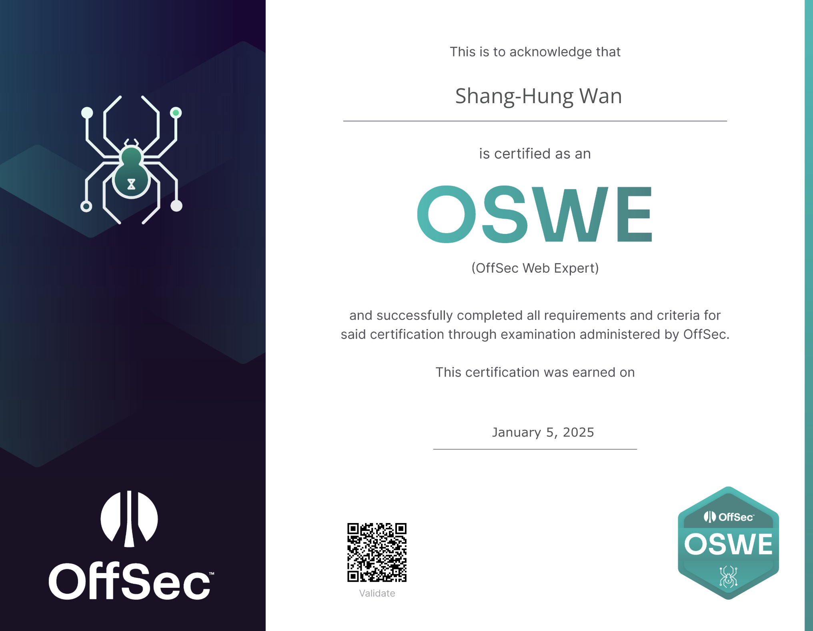

## Introduction

這篇是第三集了，一樣附上上集連結 [OSWA RTA 之旅](/blog/2024/09/11/offsec-oswa-exam/)，考試過程要注意的都寫在上一篇了，這篇就很單純的心得，第一次考 OffSec 的人有興趣也可以先看一下上集了解考試會遇到什麼。

一樣會這這篇分享一下通過之後的心得跟一些給這張證照有興趣的人的建議。

<!-- more -->

一樣先上人權：

## Exam

雖然這張證照算是 OSWA 的進階版，但以自己體感來說，其實考起來是比較輕鬆的（不是比較簡單！），自己因為比較有一些 Bug Bounty 跟漏洞回報的經驗，所以像這張的精神只是要在一千行左右的 Code Base（大概？沒認真數）中找那幾個你應該已經很熟悉的漏洞，與其比起漏洞研究，不如比較接近對答案。因此不會像 OSWA 在那邊通靈或要暴力的把所有可能性試一遍，最差的狀況就是多看幾遍程式碼而已。

還有一個比較輕鬆的部分是只有兩題，兩台機器各兩個 Flag，提權拿 35 分，Shell 拿 15 分，所以一台 Shell + 一台提權就可以及格了。

雖然這樣說，但我其實也沒有拿到滿分 🫢，只有剛好拿到及格的 85 分，時程大概如下：

-   0 ~ 5 hr: 第一台的 local.txt
-   5 ~ 15 hr: 睡覺
-   15 ~ 19 hr: 第一台的 proof.txt
-   19 ~ 20 hr: 吃飯
-   22 ~ 23 hr: VPN 爆炸（後面會說）
-   23hr: 第二台的 local.txt
-   24 ~ 37 hr: 睡覺
-   37 ~ 46 hr: 繼續掙扎
-   46 ~ end hr: 寫報告、截圖、確認 PoC

這次也是考好考滿，不過大概是這次作息比較正常，再加上只有第一天稍微熬一下夜，而且都有充足的睡眠，考完倒是沒想像中的累。

至於 VPN 爆炸，那時突然發現考試的 portal 跟機器都連不上，而且是每 1.5 分鐘就會斷線 30 秒的穩定斷線法，我一開始想說大概是他們 infra 問題，但監考官只有跟我說你有試過重開嗎，然後說他們顯示我連線正常，所以自己搞了快一小時後差點崩潰，後來索性整台 VM 重開竟然就解決了，我推測大概是他們 VPN Server 沒有偵測但會擋重複連線，手動切 VPN 重連又沒切乾淨造成的。

另外一個比較吃運氣的部分大概就是抽題目了，因為總共有五個語言，如果抽到自己比較熟悉的語言當然考起來輕鬆很多，自己很幸運剛好抽到兩個自己最熟的，所以其實算是速度蠻快的，不到 24 小時就及格了，本來想說是不是還可以早點拿到滿分早點結束，結果第二天雖然找到洞了，但不知道是不是缺了另一個洞或是單純沒想到利用方式，導致一整天都沒成功拿到 Shell🥲（~~早知道就拿完及格分直接結束考試~~）

## Conclusion

最後總結一下，雖然這張叫 Web Expert，但考完好像也沒感覺自己變 Web Expert 了，會的技能點還是跟原本沒什麼差，~~如果不是有補助或這次的機會大概我也不會用原價來考~~，畢竟這領域變動太快了，自己學還是比較能跟得上，但對初學者來說這張應該還是蠻有用的，大概 🤔

最後整理一下自己認為最重要的幾點：

-   洞都很明顯，如果你懷疑他是不是的話有可能就不是，可以先找其他的
-   利用方式通常蠻簡單的，主要還是考你能不能白箱找到洞，如果你覺得很難利用的話大概是找錯洞了
-   不一定要白箱，你比較擅長手戳的話搞不好還會比看扣快
    -   但還是有不白箱找不到的洞，不能完全不看 XD
-   有人可能說要準備蠻多工具或腳本什麼的，但其實還好，時間很夠用我都現場手搓
-   寫 PoC 的話用自己熟悉的語言就好，就算不會寫現場 Google 也可以拼出來，不要特別想說要跟題目用一樣的，會搞死自己
-   自己只有把教材看過一遍大概知道有什麼洞，Lab 跟 Extra Mile 都沒做，教材也沒什麼跟著做，但感覺難度大概就是 <= 教材（不管是 Code Base 或利用難度），所以就算沒信心，做完 Lab 應該基本上就會過了
