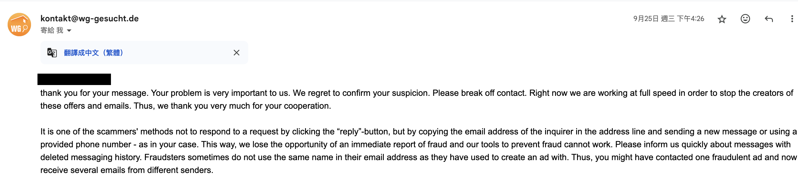

這次很幸運錄取了 2024 年秋季班的出國交換，是到德國 RWTH Aachen 的 Electrical Engineering and Information Technology 學院交換一學年，而目前已經到當地一個月左右，大致上安定下來了，因此將一年多來的準備以及這一個月來的經驗寫成心得文，希望可以幫助到也想出國體驗不同生活的大家，也期望自己可以在一年後帶著滿滿的收穫回台灣並再寫續集，也希望這系列可以稱得上是完全攻略 🤣。

<!-- more -->

## 前期準備

出發前有非常多東西要準備，同時也是越早開始計劃跟準備越好，避免臨時發現缺東西或是資格問題導致要延期一年，甚至是只能忍痛放棄的情形發生。

### 語言

個人認為需要最早開始準備也是最重要的就是語言，尤其是像我語言底子不好的，個人大概從決定要交換，也就是碩一上就開始準備英文及托福的考試，實際大概花一年準備，不過如果是語言底子比較好，或是本來就有很好的檢定成績，這個準備時間甚至是可以忽略的。這關以我們學校來說，是最基礎的門檻，視想去的學校而定，沒有過門檻甚至有可能直接沒辦法填志願序。

個人是自己陸陸續續讀了半年，後面又上了大概五個月的補習班，第一次去考的時候雖然有到大部分學校的門檻，但三個月後發現離申請獎學金的門檻差兩分，只好忍痛再拿起魔法小卡刷了第二次的報名費，重考後進步了 7 分，只能說好險自己有提早開始準備，才順利拿到獎學金。

但我直到一月才確定錄取的學校，也突然發現目的地竟然變成德國了 XD（這邊後面會講到），但個人完全不會德語，也因為之前已經花了不少錢在英文補習上，就決定先不報名德語補習班，而是先在學校上基礎德文課並同時用 Duolingo 搭配 Anki 自學（勉強算是鍛鍊一些語感，但不要對他期望太多 XD），到當地後再上學校的德文課，畢竟學校是以英文授課，應該不會有太大的問題。

### 簽證

當確認錄取後，最重要的事情就變成簽證了！畢竟你就算錄取了，到不了當地還是無法成行的，畢竟德國簽證難預約是眾所皆知的，而且每個學校的行政時間其實不一定，所以有很大機會你拿到時大家都已經確定一段時間了，這時你要預約則是一位難求，因此建議要早點上德國在台協會系統預約，如果可以的話可以在拿到錄取通知前，先約個你覺得差不多可以拿到的時間，避免預約不到的窘境；而另一種方式則是使用團體預約，先找同學校到同一間學校交換的同學們一起揪團，再寄信到德國在台協會預約時間，通常這種方式就算系統滿了他們還是會幫忙安排，因此是比較方便的方式。

至於簽證文件的準備，請自行上德國外交部網站查詢，而且很貼心的有繁體中文，其中大部分交換生需要的文件都是一兩天都可以解決的，但其中比較麻煩的會是保險及限制提領帳戶（Sperrkonto），這兩個會需要一點時間處理，所以也要在辦簽證前就確認辦好，才不會拖累到簽證發放的時間。

這兩個個人是選擇用 Expatrio 來一次處理掉，當然價格可能會比你自己去找保險業者（例如私保的公司）貴一些，但比較方便，例如可以用英文很快完成書信往來，或是他們會幫你跟業者溝通，再加上大部分這幾年的交換生用下來也都沒太大問題，因此個人還是選擇用這間公司的服務。

> 有興趣的話可以用我的推薦碼來辦，雙方都可以拿到現金回饋，不無小補（你可以拿到 15 歐）
> https://www.expatrio.com?f=shanghungw1

開戶的部分沒什麼特別的，但關於限制提領帳戶跟保險個人都各遇到一個問題，首先是限制提領帳戶的金額，要確認是德國外交部上最新的金額，因為我在申辦的時間，剛好前一個月德國剛剛宣布調升每月限制提領帳戶的金額（萬惡的通膨 QQ），因此我在申辦的時候直接用了 Expatrio 的每月金額去匯款，導致最後金額短少，雖然沒卡到簽證申請，但也是到簽證申請前一天才成功補上，算是有驚無險；但保險就沒這麼幸運了，由於我是交換一學年，而德國方面要求全程都需要有保險，但 Expatrio 的 Incoming Insurance（他們是跟 DR-WALTER 合作）預設是 185 天（我沒記錯的話），因此會被判不符標準，因此用正常流程跑完後，會需要寄信跟 DR-WALTER 申請要把保險期間延長成一年，才可以用那個文件去申請簽證。

> 要確定你拿去申請簽證的文件是 365 天！

但也好險他們的補件只需要回去再把錯誤或短少的文件郵寄到在台協會就可以了，因此這關最後也是在幾個禮拜後順利通過。最後要注意的是辦簽證期間護照都在他們手上，因此若有其他手續或流程要跑的最好事先辦好，而結束後他們會再用貨運寄回來（很...的嘉里），所以去辦的時候可以記一下那張貨運單的編號，方便上網查詢貨運進度。

額外提一下，關於申請簽證的開始跟結束日期，如果你是想要去參加開學前的密集課程，要注意可能需要在開學前一個月左右就抵達當地，而且在申請簽證的時候也要附上密集課程的相關證明（我沒實際申請所以不確定，但簽證送件的人員說建議附上），證明你確實是為了學校提早到當地，否則通常他們只會給到大概開學前兩個禮拜的時間。另外如果是役男，又想提早到當地參加密集課程的話也要注意，因為台灣的出境規定不能超過一年，所以可能會需要比其他人早回來。

### 機票

機票的話其實沒需要太大注意的地方，通常用學生優惠（ISIC）或是早鳥買都可以買到不錯的價格，個人算比較晚，在簽證確認後才買的，但也大概用學生優惠買到 24k 左右國泰的單程從桃機到法蘭克福（香港轉，總共約 16 ~ 17 小時），沒有我想像中的貴，如果更早或是直接買來回（記得買可以改票的），應該可以買到單趟一萬多的，可以自己多查一些其他教學。

另外關於機票時間的話，由於時差問題，個人推薦台灣晚上飛，德國早上抵達的班機，剛好可以在飛機上吃飽跟睡一下，下飛機就開始新的一天，但缺點是在飛機上不容易睡得好，主要是位置太狹窄，連腳都伸不直，白天精神可能會不太好 🫠

> 早上七點的法蘭克福機場，飛機剛落地

不過後來想想，其實華航的直飛也沒有差很多價錢，再多個幾千就可以買到，雖然我的轉機過程沒有等很久，但直飛應該會舒服不少，所以預計回程也會改買直飛，比較一下兩者優劣。

如果是選轉機的話要斟酌一下轉機時間，我當初買票的時候想說因為轉機時間在半夜，時間越短越好，就選了一個只有一小時的機票，結果當天在報到時，地勤跟我說香港機場非常大，轉機只有一小時一定來不及，但還好早一點的班機還有空位，就直接協助我改票了，很感謝他有注意到我的班機時間，不然搞不好要重買第二段機票了 🥹

### 學校手續

#### 母校手續

學校手續應該算是這些項目中比較簡單的，不過應該各校多少有出入，這邊最重要的大概就是在校成績了，也是一項若不提早計劃就沒辦法挽救的項目，因為後續在篩選跟排志願序時，在校成績其實佔蠻大一部分的比例，因此會很大程度地決定你是否可以去到理想的學校或是否可以出國。當然也不是只看成績，像是研修計劃、自傳、語言成績也都有一定的比例，因此好好準備這些文件也是很重要的一環。

依照學校的規定準備完資料送出校內甄選後，同時也要排志願序來決定想去的學校，最多可以填十間學校，因此填滿的話應該通常不會有落選的情況（至少我沒聽說過），個人在填的時候主要參考了各姐妹校的資工領域及學校綜合 QS 排名，且盡量以歐洲學校優先，主要有幾點因素，一是第一順位的美國幾乎沒有碩士合作的姊妹校（唯一一個是自費的）；二是臨近亞洲國家相對熟悉，個人希望可以強迫自己踏出舒適圈；最後則是從來沒有去過歐洲，希望去接受一下文化衝擊跟學語言。

> 雖然這樣說，但自己在填志願序時還是偷偷排了一間日本，其實等分發的時候有那麼一點點希望可以前面都落選，就可以去很喜歡的日本了 🤣

分發結束後就會同時拿到成績跟分發的學校，如同前面所提到的，我錄取了志願四，自己猜測主要是自傳跟語言成績偏低的關係，再加上前面的志願序名額很少，因此競爭激烈，而 RWTH 名額比較多，因此落在這邊。

> 順便記錄一下今年我們學校交換姐妹校大致的分佈，可以看出德國是最多的，這大概也是我被分到德國的原因 🤣

關於志願序也稍微提一下，如果是校級交換因為沒有資格限制，通常競爭會比較激烈；而院級交換則是因為只有特定的學院可以申請，相對的比較好上，若自認成績比較低的話可以優先考慮院級交換。另外像院級也不是一定會交換到一樣的學院，例如我的交換就是交換到對方的電機資訊學院，其實對我來說有興趣的課就少了很多，雖然理論上還是可以跨修其他學院的課，但多少還是會有一些限制，要稍微注意一下。

其他手續就比較無聊，所以就不特別提了，好好讀過說明跟文件的話應該就沒什麼大問題，這邊僅說明大家應該最關心的獎學金，獎學金會是在確認學校之後再送出申請，如果是秋季班就會是一月底二月初左右，所以其實知道可以出國的時候是不保證有獎學金的，這點其實也有點不安，畢竟出國花費蠻大的，沒有獎學金的支援就差很多。而我也是這時候（大概一月底）才發現雖然在校成績有通過門檻（沒錯，這邊也要看成績），但震驚的是托福成績剛好與申請門檻差臨門一腳，因此就如前面所提的，發現來得及在申請截止前再考一場並拿到成績，就又送了萬惡的 ETS 200 多美金 QQ 還好後續也成功越過了門檻，但獎學金的審核要花很久，雖然是二月截止，但直到六月才通知是否拿到獎學金。這邊要注意的是獎學金的文件要早點交，我因為剛好在九月底接近十月時繳交，導致撥款似乎沒排進十月，到寫這篇文的抵達當地一個月後都還沒拿到 🥹

#### 姐妹校手續

大概在三月底左右會收到姐妹校的聯絡，其中就會告訴你該做的事，比較重要的就是先送出 Application 跟開始找住宿，住宿的話是德國最重要也是最難的部分，所以一定要早點開始，不然搞不好會流落街頭 🫠 首先，這間學校因為收了超多國際生（好像總共有一萬多，比他們本國籍還多），加上德國眾所皆知的租屋地獄，即使是德國學生也要花一些時間來找，所以交換生的找住宿難度可想而知，而它也不像台灣會保障交換生或國際生住宿，一切都要自己想辦法。

他們的學生會提供一些宿舍，但數量很少，因此最好是這時候馬上上去申請帳號（[連結](https://bewerberportal.stw.rwth-aachen.de/)）並開始排，才有機會在十月開學時入住，不然是不可能在開學前排到的，像我是五月左右排的，現在十月底了還沒排到，所以越早開始排機會越高。

接下來等到完成 Application 後，就會拿到入學許可（大概會是六月），就可以去辦簽證、跑學校手續等等了，這邊也可以趕快先去申請 BeBuddy 計畫，學校會分配一個 Buddy 給你，通常是 RWTH 待了很多年的學生，可以回答你蠻多關於德國或是學校的問題。但就如同前面所說，這學校國際生超多，所以 Buddy 供不應求，早點排才有機會在你需要的時候有 Buddy，像我是已經到當地獨立了半個月左右後才被分到，其實該撞的牆或是該踩的雷都踩過了 QQ，所以其實已經沒什麼太大問題需要問。

接著在六七月左右也會收到信，提醒說 Welcome Week 跟開學前密集德文課程的時程，這時就可以開始準備行程，像是機票跟住宿（如果還沒找到長租的話，先訂短租），如果沒有想參加密集課程的話，就建議在 Welcome Week 前抵達，才比較好融入跟認識其他國際生。不過要注意他們有兩個 Welcome Week，一個是給國際生，結束後的下禮拜就是給一般生，雖然都會以英文為主，但建議只參加一個的話還是參加比較早、也就是國際生的，比較實用一些。

最後就是八月，可以的話建議一開放註冊就趕快註冊，並記得繳費才能完成註冊，到這邊才算確實拿到學生身份！

### 其他準備

#### 行李

整理行李也是很重要的一個環節，雖然通常機票只有 20 ~ 24 公斤 \* 2 的行李額度，乍看之下可能會不夠用，畢竟是要去一年，但其實我認為應該是蠻夠用的，除非你真的打算把台灣所有東西搬去 🤣

這邊先分享個人清單，可以以這份清單為基礎去做整理或調整，雖然東西看起來很多，但其實還有蠻多空間的，所以應該還可以塞蠻多重量不重但體積大的東西，但建議不要裝重量太滿，一是在家秤跟在機場秤可能重量不一樣，我到報到櫃檯秤的時候其實有些超重，但地勤人員人很好沒算我超重 🙏；二來是不是每個地方都有電梯，沒有的話你就要扛著 24\*2+10（後背包）= 58kg 的重量上下樓梯，我自己自認還算是有力氣的，剛到的一兩個禮拜都因為常常要換住宿點，都有點拉傷，建議量力而為，而且一個人顧兩個行李箱也算是極限了，三個的話我真的不知道怎麼帶 😶

> 兩個行李箱就已經很難在火車上找位置了 🥹

##### 腰包

這邊就放最重要的物品並隨身帶著，除了洗澡都不能拿下來！

-   護照
-   國際駕照
-   錢包
-   行充
    -   要確定容量符合航空公司規定
-   役男出境證明
-   耳機
-   防盜繩
    -   拿來綁住錢包

##### 後背包

這邊也裝重要的東西，盡量把拉鍊用登山勾之類的東西綁起來，就會安全許多。

-   筆電
-   文件影本
    -   可以把護照、國際駕照、駕照、入學許可、機票、簽證、宿舍合約（如果有）等等的重要文件都影印一份。
-   頸枕
    -   雖然只有來回的那十幾個小時會用到，到了之後就有一年不會用到，但我覺得蠻值得帶的，畢竟在飛機上真的蠻痛苦的 🫠
-   轉接頭
    -   單純轉形狀的轉接頭就可以了，因為現在應該大家的充電器都是國際電壓，如果只有 110V 的話，記得要帶可以轉電壓的。
-   充電器
-   USB HUB
-   防盜繩
    -   我把一部分現金放在另一個零錢包用防盜繩綁住，避免一起被偷。
-   耳塞
    -   也是飛機上必備，如果會住青年旅社之類的地方也是必備。
-   眼罩
-   Switch
    -   路上不會用到，單純我想盡量把比較貴的東西帶在身上而不是托運。
-   帽子
-   外套
    -   視個人需求可以上飛機前先穿好或是帶在包包裡，畢竟從台灣到德國溫度會驟降十幾甚至二十幾度。
-   行李秤
    -   這是沒帶，但是推薦帶的，如果一年內要出去玩或是回國整理行李時很方便

##### 行李箱

-   文件影本
    -   沒錯，我每個地方都帶了一份，分散風險，甚至兩個行李箱各放一份 XD
-   密碼鎖
    -   住青年旅社之類的地方必備，很多地方是沒保險箱或櫃子的。
-   文具
    -   帶一些簡單的文具，不過目前為止沒什麼用到，只有美工刀比較實用。
-   網路線
-   HDMI 線
    -   這個是我沒帶到，但推薦帶的，如果你是雙螢幕使用者，應該會到當地再想辦法弄個螢幕，但如果沒有線的話，當地買很貴，讓我買的時候很心痛 🫠
-   延長線
    -   這個我考慮很久，主要是電壓不同其實不太適合，但後來我買了轉電壓的轉接頭，想想這樣只要一個轉接頭就可以插全部帶去的電器，方便不少（要注意用電安全！自己算一下電流量）
    -   如果怕安全問題或是沒帶什麼台灣的電器過去就推薦到當地再買
-   電動刮鬍刀
-   電動牙刷
    -   其實德國買好像比較便宜，但是想說還能用就帶著了，如果壞了再買新的回去好了 XD
-   滑鼠
-   手機無線充電座
-   螢幕掛燈
    -   這個體積有點大，但我覺得也是很實用的，德國不知道是不是很流行在燈具裝 LED 燈片，然後又買不到替換的（大概是商人手段，逼你整組換掉），導致房間很暗，為了眼睛著想，必帶！
-   食物
    -   這也很重要，因為雖然幾乎每個城市都有華人超市或亞洲超市，但通常都是中國製貨日韓的，很少有台灣的牌子，建議可以把行李箱剩的空間都用台灣零食泡麵填滿，自用送禮兩相宜
    -   我帶了鳳梨酥、小泡芙、蛋捲、煎餅、芒果乾、果凍之類的
    -   還帶了一些玉米濃湯、咖啡粉、茶包、濾掛
    -   推薦可以帶一些這邊很難買或很貴的調味料或食材，我帶了白胡椒、豆瓣醬、辣椒醬、滷包、花椒粒，但其實後來逛亞超發現都有賣，所以其實放不下不用特別帶 XD 只是缺點是都是中國牌子，不喜歡還是可以自己帶
-   個人藥品
    -   雖然這邊要買藥妝也很方便，不過還是可以先帶一些自己習慣的
-   簡單的盥洗用品跟保養品
    -   也是為了前幾天做準備，一開始可能還沒時間採購
-   口罩
    -   帶了一包，但發現根本沒人在戴，我從在台灣是每天必戴，到這邊也懶得戴了 XD 不過打掃的時候還是會用到，所以還是可以帶一小包
-   備用眼鏡
-   環保袋
    -   這邊基本上不會給袋子，所以很實用，記得帶大一點的，可以購物、裝換洗衣物
-   指甲刀
-   護手霜
-   保健食品
    -   這邊也超多保健食品，價格也都不貴，所以除非有品牌偏好，不然帶一點點到當地再買就好
-   拖鞋
-   靴子
    -   冬天會下雪，所以如果本來就有可以帶來，沒有的話就當地買
-   七天份衣物
    -   七天份應該就夠用了，剛好一個禮拜洗一次，去自助洗衣店也是剛好一台洗衣機的量
-   棉被
    -   帶了那種不太厚但是很保暖的棉被（好像是石墨烯之類的），再跟幾件大衣裝一起抽真空，其實不太佔位置，蠻推薦的
-   手套
-   圍巾
-   毛巾
-   洗衣袋
-   環保餐具
-   備用充電頭跟各種線材
-   轉接頭 \* 2
    -   多帶幾個，只怕不夠用不怕帶太多

#### 役男

這部分就跟簽證一樣重要了，如果沒弄好也是會出不了國境的，首先要記得在出境一個月前跟學校申請，學校會再幫你轉到你的戶政區公所處理，最後會發公文給你，雖然通常 1 ~ 2 個禮拜就會下來，但建議不要賭這個時間。最後拿到公文後，上「役男出境核准通知單查詢及列印系統」列印出來，就可以帶著它在申請的時間內出境了！

> 關於申請的起始跟結束時間可以參考簽證那邊。

#### 保險

保險的話，如果你跟我一樣用 Expatrio 的話，就直接用他合作的廠商就沒問題了，但建議還是全程有保險會比較好，所以可以保個旅遊險，涵蓋從台灣家裡出門到抵達德國當地的時間，大概一天就夠用了，到了當地之後因為有 DR-WALTER 的旅遊險，就不需要了。

再來有人可能會想問健保需不需要停掉？個人研究後的結果是建議不用，畢竟通常是以眷屬掛在爸媽底下，通常保費也不會太高，而且其實在國外如果有就醫（要符合緊急就醫定義），其實也可以保留單據，回國之後申請理賠，所以如果只是去一年內的話就建議不用，一年以上或是保費很高的話再來考慮。

## 剛抵達

坐了十幾個小時的飛機後，總算抵達法蘭克福機場，正式開始新的生活！由於我在台灣時沒有排到宿舍，也沒有找到住宿，因此就先訂了兩個禮拜的住宿，由於盡量找了價格低的，因此拆成了三家不同的旅館，雖然常常搬行李蠻累的，但是可以體驗一下不同的旅館也蠻有趣的。

另外關於如何從法蘭克福到阿亨，我是搭德鐵 ICE 轉乘一次就到了，其實 ICE 也有直達的，但是會貴一點，不想提行李或是趕時間的話可以選直達的比較方便，另外可以用他們的 APP 買票（後面會提到），價格會便宜一點。

### 住宿

找住宿是這邊最困難的一件事了，我自己主要是在 wg-gesucht 這個網站上找，可以同時找 WG（合租公寓）或是單戶的，由於德國租屋僧多粥少，因此競爭非常激烈，通常把房源不要太偏僻或太貴的話，信箱都會直接被幾十甚至幾百封詢問信塞爆，尤其是在開學季更是嚴重。為了體現難度，提供我的紀錄給大家參考，我總共寄了 223 封訊息，其中至少有 10 封明顯是詐騙，被拒絕 14 次，獲得參觀機會 5 次，面試都沒有這麼難 🫠。

上面 PO 廣告的通常有兩種身份，一是房東、二是 WG 的室友，所以傳訊息的時候可以依照類型不同微調你的訊息，例如房東可以著重在你的收入來源或是你的身份之類的，因為他們可能會比較擔心是否可以準時收到房租或是房子的維護等等；室友則是可能比較注重你的個性或興趣之類的，因為他們會實際跟你一起生活。

我自己的訊息主要內容是（用機翻的德文）：

-   目前是學生，來自台灣哪間學校，接下來一年會在阿亨讀什麼科系
-   我的個性（例如負責任或重清潔之類的），如果不吸菸也可以提一下，希望住多久
-   自己的興趣或休閒活動，可以的話提一下語言，會德語通常比較加分，至少也要會英語
-   簡單介紹完後可以提問一些關於房子的問題
    -   是否可以到場看房
    -   是否可以 Anmeldung
    -   其他廣告中沒提到的，例如費用或是合約期限之類的
-   為了增加我們的可信度，可以提到我們可以提供文件，讓對方確保我們不是詐騙
    -   入學證明
    -   Blocked Account 證明
-   最後可以打鐵趁熱，直接提供我們方便的時間，詢問對方是否方便在這時間內到現場看房

另外最好設定 email 通知，並且常常上去看有沒有新的廣告，在第一時間就寄訊息比較容易拿到看房機會，而能不能順利租到房子就看造化了。另外很重要的是最好把標準放低，盡量把每一個廣告都寄一次，因為在德國租屋競爭激烈，蠻常出現到現場看房的時候，現場圍著十幾個都是要看房的人，因此你要打敗其他十幾個人才能成功租到，所以把標準放低才比較有機會租到房子，例如稍微超出預算或地點偏遠的，通常競爭者比較少，這時才比較有可能租到。

最後是也要小心詐騙，例如除非現場看過房子，就盡量避免先匯錢、先寄文件（不管是電子檔或紙本）、或是嘗試用其他管道聯絡你（例如 Email、WhatsAPP 等）、或是提到他人現在不在阿亨、可以線上完成後續再寄鑰匙給你等等，基本上都是詐騙，雖然流浪很恐怖，但是也小心不要被詐騙了，真的有疑慮可以寄信給官方的信箱 `kontakt@wg-gesucht.de`，詢問是否是詐騙。

> 大部分的詐騙其實都蠻明顯的，但有一個感覺又有點介於像跟不像之間，不想漏掉機會，因此還是問了官方，很遺憾還是詐騙 🫠

### 學校

雖然錯過了國際生的 Welcome Week，但抵達之後還是有參加到一般的 Welcome Week，這個因為也是有一些國際生（但似乎就都是學位生，只有我一個交換的），所以主要還是以英文進行，不用太擔心聽不懂。第一天主要介紹一些基本事項，例如修課規定或其他有關學位的規定等等，結束後還有簡單繞著市中心散步做 City Tour；第二天就是介紹如何使用學校的線上系統，前兩天的晚上也都有一些 Party，不過我剛好卡到要去看房子就錯過了 QQ 後面兩天就分別是 BBQ 跟大地遊戲，也都蠻有趣的 👍

至於課程的話，其實個人覺得內容跟難度與台灣沒有差很多，不過差別是大家真的都比較踴躍問問題，而似乎他們也蠻常動不動就跑去旅行或翹課（？），所以不知道是不是因為這樣，蠻多課程都有錄影或是線上同步，算蠻方便的。另外一個蠻有趣的是他們其實很自由，大概是刻在骨子裡的基因所使（？），選課跟聽課都是很自由的，也就是你選不選或出不出席都可以自由選擇，你只要記得註冊參加期末考就好，像是我一開始去外系的課程想要加選的時候，老師就有提到說其實沒有在選課系統登記也沒關係，因為它只是會自動把你加到課程平台，讓你可以看講義。

> 不過要注意的是，雖然大部分的課都不用出席，作業通常也不計分，但有的老師會把作業當作參與期末考的條件，所以第一堂課一定要聽清楚！

除了專業課程，我也修了密集德文課程，一週總共四堂課，其實再加上兩門專業就非常吃力了，老師基本上就是從最初階開始教起，也會搭配小道具或小遊戲讓同學互相練習，每堂課結束也都會有回家作業跟參考影片讓你回家複習，整體來說我覺得蠻紮實的，不過這其實是要付錢的，密集課程是一學期 400 歐，一般的課程（每週兩堂課）就是一學期 200 歐，可以看出他們的使用者付費精神貫徹地很徹底。

另外他們還有很多種類的體育課程，你想得到跟想不到的種類都有，我覺得蠻不錯的，但缺點是學生太多、課程太少，熱門的課程基本上沒有在開放的時間準時上去搶基本上搶不到，而且因為是額外的課程，理所當然也是要付費的。

還有一個很有趣的，當你上完你的第一堂課，老師宣布下課後，全部人就會開始敲桌，這時不要嚇一大跳，這是一個稱為 Akademisches Klopfen 的傳統，基本上就是取代鼓掌的行動，只要用你的指節跟著大家一起敲桌就可以了，由來似乎已經不可考了，但是蠻有趣的，就入境隨俗吧 🤣

### 食衣住行

#### 食

如果剛到當地，你就會發現這邊物價跟台灣完全沒得比，三明治一個 150 台幣起跳、一餐 350 台幣起跳，所以除非你錢帶了太多，不然都是逃不過自煮的命運，自煮的話就其實便宜不少，像我的第一個月大概六七成都是自己煮，剩下出去吃的餐費 + 食材費大概是 16000 台幣，平均起來每餐比外食便宜太多了，而且還包括不少第一個月的調味料的花費，所以不會煮的還是建議學些懶人料理，才不會在吃上面花太多錢 🫠

另外學餐也是你的好夥伴，學餐的 Classical（他們的經典菜式？）只要 2.8 歐，如果吃不習慣也有其他選項，但基本上也都不會超過 5 歐，算是非常划算的選擇！

> 但...你會懷疑歐洲人真的都吃這種東西嗎，就馬鈴薯泥配一根香腸再配一小碗生菜

如果真的要出去吃的話，通常都是 10 歐起跳，但如果不想花太多錢的話，滿街都可以看到的 Döner 就是你的好夥伴了，通常只要 6 ~ 8 歐就可以有含有肉、菜、麵包的一餐，基本上蠻大部分都是土耳其老闆開的，也就是我們很熟悉的土耳其沙威瑪！

> Döner 有很多類型，像這個就是麵包夾肉的經典類型

> 這就是裝成一盤，配沙拉跟薯條的

自己煮的話，其實這邊食材大概找一下特價的話，是會比台灣便宜的，但如果你像我一樣想煮台灣菜的話，就會因為要去亞超買一堆很貴的調味料，所以成本提高一些，但若是他們一般德國超市買得到的食材的話，其實都是算蠻便宜的，可以省很多錢！

> 孢子甘藍，很有營養也不貴，也很適合懶人料理

> 在台灣超貴的氣泡水在這邊都超便宜的，喜歡的人可以趁這機會多喝點 🤣

另外，雖然他們冷水理論上都是可以直接喝的，但德國人基本上都是去超市買水，我自己不想每天去超市扛水，也不太想直接喝，就買了 Brita 的濾水壺，喝起來比較安心一點，是剛好遇到 Saturn 特價買的，還蠻便宜的，但之後沒特價可能會找其他牌子的濾心，畢竟原廠的有點貴 🥲

另外很多人可能也會想帶電鍋來這邊，但是因為是高功率的電器，而且台灣其實不好買 220V 的電鍋，所以建議還是不要，到這邊後再買就好，雖然可能沒大同好用，但基本上煮飯或是簡單料理都還是沒問題的，我自己是在 Amazon 花 29 塊買了一個二手的（但幾乎全新）。

另外想抱怨一點，不知道是不是德國人都不會用不沾鍋，還是我遇到的都是特例，他們每個人都拿鐵刷刷、不然就是直接拿鐵鏟炒，然後每個不沾鍋都塗層掉光光還在用，我看了都心驚膽跳，一開始都只敢用不鏽鋼鍋炒菜，但要做炒或是煎的料理難度太高了，最後只好自己買一個不沾鍋好好保養，不然這一年不曉得要吃多少毒素 🫠

#### 衣

我目前還沒逛過他們的服飾店，不過他們似乎蠻流行二手衣物的，目前覺得我的衣服不太夠這邊的冬天，現在十月底我就快冷死了 🥶，預計再冷一點會去逛逛二手衣物店，聽說可以用很便宜的價格買到不錯的衣物，如果沒有靴子應該也可以在這邊買到，所以本來沒有適合的衣物的話，建議到這邊再買就好！

#### 住

長租的部分上面講過了，這邊講一下我剛到當地的三間住宿，都是在 booking 上找的，本來還有用 Airbnb 找，不過價格都貴一點，時間也不太 OK，後來都還是在 booking 上訂了。

總共住了 14 天，花了 357 歐，因為主要都挑便宜的住，因此價格以當地來說還算便宜，綜合來說品質是還可以，不過後面兩間都是多人住一間的背包客棧形式，，因此比較在乎品質或安全的還是可以多花點錢住貴一點的。

住久一點的話可以盡量挑有廚房的，可以在住宿期間開伙的話能省不少錢，另外就是前面有提到，貴重物品還是要收好並隨身攜帶，因為有的民宿連房間門鎖都沒有 🤣

#### 行

這邊的主要交通就是公車，要去遠一點的城市就要搭火車，不過基本上不會花到什麼錢，因為每學期學校會發交通票，在該學期內，全部的公車跟區間車的火車都是可以搭到飽的，所以不太會花到什麼錢。

另外網路也是跟生命一樣重要的部分（？），這邊建議可以先在台灣買半個月到一個月的當地網卡或是直接用漫遊，到了之後再來買當地的預付卡，會比較划算，我自己是買了一個月的網路，等找到住宿後再來辦 fraenk 這家的號碼，他每月是 10 歐 12 GB，或可以選 15 歐 22 GB，價格算是還可以接受，目前用起來市區覆蓋率也都不錯，唯一缺點是 APP 只有德文。

> 有興趣的話也可以用我的推薦碼，兩個人都可以每月流量 +3GB，可以用 SHAW22 或點[連結](https://fraenk.page.link/?link=https%3A%2F%2Ffraenk.de%2Fdeeplink%2Fmgm%3FfriendCode%3DSHAW22&apn=de.congstar.fraenk&amv=1040000&imv=1.4&isi=1493980266&ibi=de.congstar.fraenk&ius=fraenk&ofl=https%3A%2F%2Ffraenk.de)

#### 其他

銀行的話，因為德文不好不想跑現場，所以我是辦一個叫 N26 的網銀，知名度也算蠻高的，很方便且使用上也沒遇到問題，唯一的缺點是存錢要手續費，不過基本上只是交換或短期留學的話，應該也不會用到存錢的功能，畢竟都是支出沒有收入 🤣 平常消費也只要帶著手機綁信用卡（可以選虛擬或實體），大概八成的店家都可以刷，如果辦帳戶的時候選 Business，刷卡還可以有 0.1% 的回饋，不無小補（我看了申辦資格是說 freelancer 之類的，但實際不會跟你要證明，如果心臟大顆一點的可以試試看）；如果不想賭的話就選 Free 的 Plan 就好，蠻夠用了！

> 想註冊的話可以先[聯絡我](mailto:sun@taiyou.tw)並用我的邀請碼，我會把 50 歐的推薦獎金跟你對分！
> shanghuw5921 https://n26.com/r/shanghuw5921

另外我也有在台灣先辦好 Wise，並先把歐元轉到 Wise（建議最好準備 1.5 ~ 2 個月的生活費，因為還要繳押金跟房租），到這邊辦好 N26 後，再把錢轉進 N26 就可以方便消費或是提出來了，一開始繳房租跟押金也是直接從 Wise 轉過去，好處是歐元互轉不用手續費，所以只要負擔一次台灣轉到 Wise 的貴鬆鬆電匯費即可。

> 想賺錢的話可以一樣用邀請碼註冊，每三個人註冊的話就有 50 歐獎金，一樣我會跟註冊人對分！
> https://wise.com/invite/ahpc/shanghungw

再來，抵達當地並辦好 N26 後，還要記得趕快把 Expatrio 啟用，才能趕快領到第一個月的 Blocked Account 的生活費，只要下載他們的 APP 並拿著護照跟客服視訊就可以了，同時也要記得啟用保險，過程中 TK 會寄好幾封信到你的地址，啟用的幾個禮拜後就可以收到保險卡了！

最後是很重要的入籍，德國的入籍是出了名的麻煩，如果你沒有在台灣好幾個月前就預約，現在是一定約不到的，只能搶別人取消之後釋出的空位，這邊推薦一個好用的 Telegram Bot，他會在有空位的時候通知你，就可以趕快上去搶釋出的空位，才能在有地方住之後盡快入籍，不然可能會拖好幾個月都沒辦法入籍。

https://github.com/noworneverev/aachen-termin-bot

他每個月的通知是分開的，所以可以點進連結找一下目前的月份加入！

相信大家看到這邊應該頭昏腦脹了，所以整理一下懶人包：
在台灣辦 Wise >> 抵達德國 >> 弄個住址（不一定要自己的，跟朋友借也行，當然最好還是用自己的）>> 辦門號 >> 開戶 >> 啟用 Expatrio、保險

> 入籍沒有寫在上面，只要有房東簽完合約後就可以隨時去（當然前提要預約到）
> 然後建議如果真的半個多月以上了，還找不到住宿再用別人的地址，不然怕後續要改會比較麻煩

#### APP

有幾個 APP 還算蠻不錯的，順便推薦給大家：

-   Too Good To Go
    -   這是一個搶救剩食的 APP，可以用很便宜的價格（兩～四折都有可能）買到餐廳、咖啡廳、飯店賣剩的食物，我有一次用了 4 歐買到可以吃一個禮拜的麵包，而且也都蠻好吃的，兼具環保跟省錢，超讚 😇
        
-   DB Navigator
    -   前面有提過，這是德鐵的 APP，雖然我們有學期票不用買票，但可以查路線、訂票，像是要買 ICE 之類的票也可以省一點錢，還不錯
-   TheFork
    -   這是一個餐廳訂位的 APP，可以用優惠的價格訂到餐廳，不過目前還沒用過，之後有機會再來用看看
-   PAYBACK
    -   這是平常消費可以集點的 APP，像是 DM、REWE、Amazon 之類的地方都有合作，消費就可以集點，可以換現金或其他東西
-   另外就是超市 APP，看你平常喜歡去的超市是什麼，通常都有推出自己的 APP，裡面多少會有優惠或集點之類的活動

> 有蠻多 APP 是會鎖區的，所以如果找不到的話，記得跨區才能下載

## 結論

以上大概就是我到目前為止交換的精華心得了，雖然還有蠻多生活小細節沒講到的，但是字數已經超級爆炸了，就以後有機會再慢慢分享吧 😆
